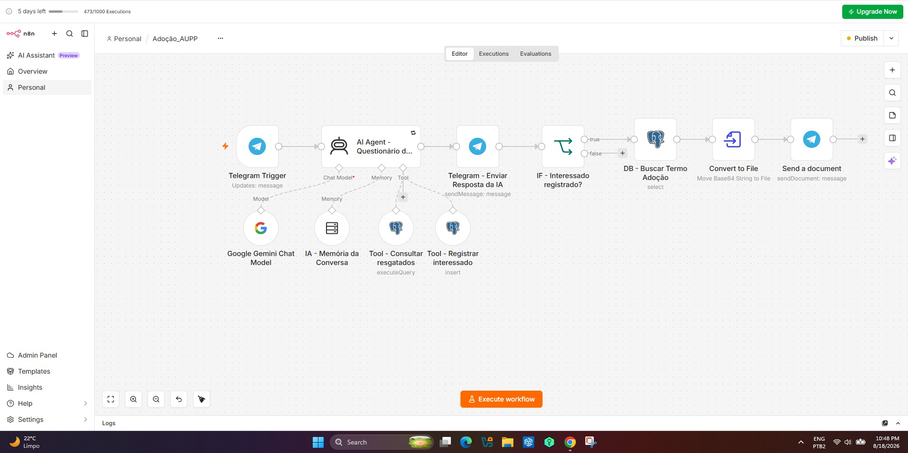

# challengAluraAgent
Entrega obrigatória para conclusão da imersão IA e obtenção do certificado.

# 🐾 AUPP - Assistente Virtual para Adoção de Animais

Projeto de um assistente virtual para apoio ao processo de adoção de animais da **Associação Unidos Pelas Patas (AUPP)**.

A solução utiliza Inteligência Artificial integrada ao **Telegram**, permitindo que uma pessoa interessada em adoção informe suas preferências, consulte animais resgatados cadastrados, manifeste interesse em um animal e receba o Termo de Adoção.

O workflow foi desenvolvido utilizando **n8n**, modelo de IA generativa e banco de dados **PostgreSQL**.

---

## 🎯 Objetivo

Facilitar o primeiro contato entre pessoas interessadas em adoção e a ONG.

O assistente conduz o usuário por um questionário para identificar suas preferências e consulta a base de animais resgatados.

O objetivo não é substituir a avaliação realizada pelos protetores da ONG, mas automatizar as etapas iniciais do processo.

---

## 🤖 Funcionamento

O atendimento é iniciado pelo Telegram.

O bot conduz a conversa fazendo **uma pergunta por vez**.

São coletadas as seguintes preferências:

1. Espécie
   - Cachorro
   - Gato

2. Pelagem
   - Curta
   - Longa

3. Porte
   - Pequeno
   - Médio
   - Grande

4. Faixa etária
   - Filhote
   - Adulto
   - Idoso

5. Temperamento

6. Aceitação de animal especial

Depois de obter as informações, o agente consulta os animais cadastrados no banco de dados.

---

## 🔎 Seleção do animal

O assistente procura o animal com maior compatibilidade com as preferências informadas.

São considerados critérios como:

- espécie;
- pelagem;
- porte;
- idade;
- temperamento;
- condição de animal especial.

Não é necessária correspondência exata entre todas as características.

Caso nenhum animal corresponda completamente às preferências, o sistema apresenta outro animal disponível na base, possibilitando que o usuário conheça um resgatado com perfil diferente.

**Se houver pelo menos um animal cadastrado e disponível na consulta, o assistente deve apresentar um animal real ao usuário.**

O sistema nunca deve inventar animais ou características.

---

## 🐶 Apresentação do resgatado

Quando um animal é selecionado, podem ser apresentadas informações como:

- nome;
- espécie;
- raça;
- idade;
- porte;
- pelagem;
- cor;
- temperamento;
- castração;
- vacinação;
- chipagem;
- convivência com outros animais;
- condição especial;
- história do resgate;
- foto.

A foto do animal é disponibilizada por meio de URL armazenada na base de dados.

O assistente também informa quais características correspondem às preferências do usuário e quais são diferentes.

---

## 👤 Manifestação de interesse

Após apresentar o animal, o bot pergunta se o usuário deseja fornecer seus dados para manifestação de interesse.

Caso aceite, são solicitados individualmente:

1. Nome completo
2. E-mail
3. Autorização para contato de uma protetora da AUPP

A autorização de contato pode ser:

- `true` — autoriza contato;
- `false` — não autoriza contato.

A negativa de autorização **não impede o registro da manifestação de interesse**.

---
## 💾 Registro do interessado

Após receber todas as informações necessárias, o AI Agent utiliza uma Tool do PostgreSQL para registrar o interessado.

Os principais dados armazenados são:
- `nome_usuario`
- `email_usuario`
- `nome_resgatado`
- `dt_envio_termo`
- `autoriza_contato`

O registro é realizado somente após a coleta das informações solicitadas durante o atendimento.

---

📄 Termo de Adoção

O envio do Termo de Adoção é realizado pelo workflow do n8n, separadamente da atuação do AI Agent.

O fluxo foi estruturado para que o envio do documento ocorra após o registro do interessado.

O arquivo utilizado no workflow é:

Termo_de_Adoção.pdf

O documento é enviado ao usuário por meio do Telegram.

---

🛠️ Tecnologias e ferramentas

| Tecnologia/Ferramenta | Utilização                                               |
| --------------------- | -------------------------------------------------------- |
| **n8n Cloud**         | Automação e orquestração do workflow                     |
| **Telegram Bot API**  | Comunicação com o usuário                                |
| **Chat Model**        | Processamento e condução da conversa                     |
| **PostgreSQL**        | Armazenamento dos animais e interessados                 |
| **Railway**           | Hospedagem do banco PostgreSQL                           |
| **Cloudinary**        | Armazenamento e disponibilização das imagens dos animais |

---

🗄️ Banco de dados

O projeto utiliza PostgreSQL para armazenar as informações dos animais resgatados e dos interessados em adoção.

🐕 Tabela resgatados

A tabela armazena informações dos animais disponíveis para adoção.

Entre os dados utilizados estão:
- `nome`
- `idade`
- `raça`
- `história`
- `castrado`
- `vacinado`
- `chipado`
- `temperamento`
- `aceita_outros_caes`
- `aceita_gatos`
- `especial`
- `porte`
- `pelagem`
- `cor`
- `especie`
- `foto`

---

👤 Tabela interessados

A tabela é destinada ao armazenamento das manifestações de interesse.

Principais campos:
- `id`
- `nome_usuario`
- `email_usuario`
- `nome_resgatado`
- `dt_envio_termo`
- `autoriza_contato`

---

🧠 Inteligência Artificial

O AI Agent é responsável por:

interpretar as respostas do usuário;
manter o contexto da conversa;
realizar uma pergunta por vez;
identificar informações já fornecidas;
consultar os animais cadastrados;
selecionar o animal mais compatível;
apresentar um animal alternativo quando necessário;
apresentar as informações do animal;
coletar os dados do interessado;
executar a ferramenta responsável pelo registro do interessado.

O envio do Termo de Adoção é realizado pelo workflow e não pelo AI Agent.

---

💬 Memória da conversa

O workflow utiliza um recurso de memória para preservar o contexto entre as mensagens enviadas pelo usuário.

O identificador do chat do Telegram é utilizado para associar as mensagens à mesma conversa.

Exemplo:
{{ $('Telegram Trigger').first().json.message.chat.id }}

Dessa forma, respostas enviadas separadamente podem ser interpretadas como parte do mesmo atendimento.

---

🔐 Cuidados com os dados

O bot solicita dados pessoais somente após o usuário manifestar interesse em fornecer essas informações.

São solicitados:

nome completo;
e-mail;
autorização para contato.

A autorização para contato é armazenada explicitamente como true ou false.

Caso o usuário não autorize o contato de uma protetora, sua decisão deve ser respeitada, sem insistência.

---

⚠️ Tratamento de falhas

Durante o desenvolvimento e os testes, foram considerados possíveis erros relacionados aos serviços externos utilizados pelo projeto.

Entre eles:

429 Too Many Requests — limite de requisições do modelo de IA;
503 Service Unavailable — indisponibilidade temporária do modelo;
falhas na consulta ao PostgreSQL;
falhas no registro do interessado;
falhas no envio de mensagens ou documentos pelo Telegram.

O workflow também utiliza lógica de controle para evitar que o Termo de Adoção seja enviado antes da etapa de registro do interessado.

---

🚧 Restrições
🆓 Foram utilizadas neste projeto apenas ferramentas e recursos gratuitos.
⏳ Os limites estabelecidos pela ferramenta Chat Model no workflow do n8n e o prazo limite para entrega do projeto impossibilitaram a geração das seguintes evidências:
💾 Gravação do interesse do usuário na tabela interessados;
📄 Envio do arquivo Termo_de_Adoção.pdf.
🐾 Associação Unidos Pelas Patas — AUPP

O projeto utiliza automação e Inteligência Artificial para aproximar pessoas interessadas em adoção dos animais resgatados pela ONG, tornando o primeiro atendimento mais simples e acessível.

A indicação de um animal e o preenchimento do Termo de Adoção representam uma manifestação de interesse.

A aprovação definitiva da adoção permanece sujeita à avaliação da Associação Unidos Pelas Patas (AUPP).

---

## 📸 Demonstração

## 🎥 Vídeo de demonstração

